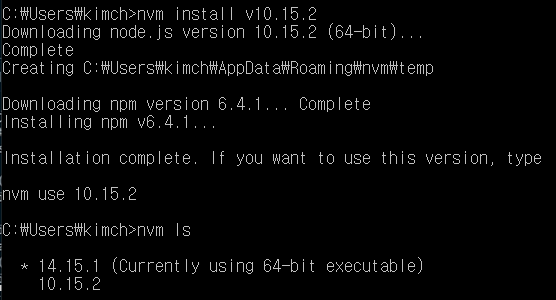

# Node.js 버전 변경 및 설치

## 원인

nvm을 통해서 node js 버전을 바꿔서 설치하려고 했는데, vscode에서는 설치가 안됐다(윈도우와 맥이 설치방법이 다른 것 같다)

## 해결

cmd창에서 해결했다

> (1)우선 그전에 필요한 node version을 먼저 다운한다. 나는 14버전을 쓰고 있었는데 10번대 버전이 필요해서 다운받았다.
>
> (2) nvm-setup.zip 파일을 다운받아서 압축풀고 실행

cmd

(1) nvm -v

(2) C:\Users\kimch>nvm install v10.15.2

(3) C:\Users\kimch>nvm ls

(4) nvm use 10.15.2

이거하면 끝!